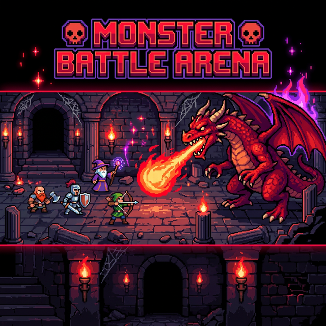
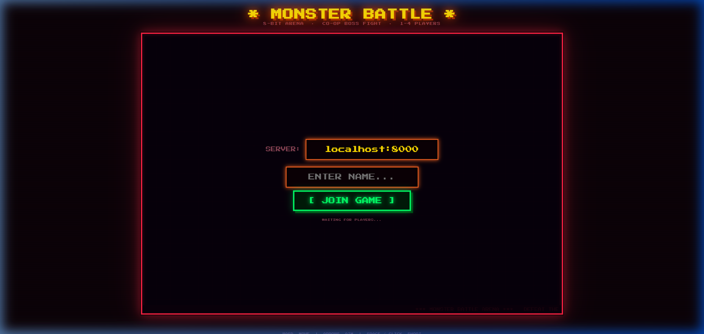
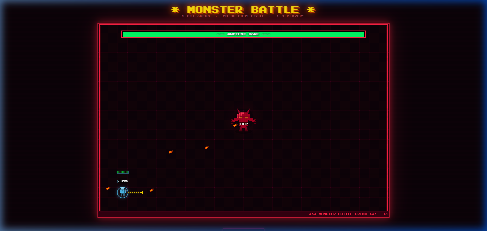
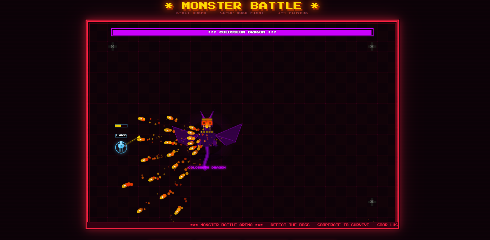

# 👾 Monster Battle Arena



Celebrate the golden era of arcade gaming with **Monster Battle Arena**—a high-octane, 8-bit cooperative boss-rush game. Join forces with up to 4 players in real-time to take down the legendary Colosseum Dragon in an authoritative, low-latency environment.

## 🚀 Key Features

- **Co-op Multiplayer**: Support for 1–4 players using real-time WebSockets.
- **Authoritative Server**: All physics, collisions, and logic are handled on the backend to prevent cheating and ensure consistency.
- **Dynamic Difficulty**: Boss health scales automatically based on the number of heroes joined.
- **Evolution System**: Watch the monster transform from a stationary Ogre into a mobile, fire-breathing retro Dragon at 20 seconds!
- **Pixel-Perfect Aesthetics**: Custom hand-drawn pixel art and retro CRT scanline effects.
- **Modern Tech Stack**: Powered by **FastAPI** (Python) and Vanilla JavaScript.

---

## 📸 Screenshots

### The Lobby

*Gather your team and prepare for battle.*

### The Arena

*Intense bullet-hell action with real-time HP tracking.*

---

## 🛠️ Installation & Setup

### Prerequisites
- Python 3.8+
- A modern web browser (Chrome/Edge/Firefox)

### 1. Setup Backend
```bash
cd backend
python -m venv .venv
source .venv/bin/activate  # Windows: .venv\Scripts\activate
pip install -r requirements.txt
python server.py
```

### 2. Launch Game
Simply open `frontend/index.html` in your browser, or if the server is running, navigate to:
`http://localhost:8000`

---

## 📖 Documentation

For deep dives into how the game works, check out our specialized documentation in the `/docs` folder:

- [**Networking & Sockets**](./docs/sockets.txt): Line-by-line breakdown of the WebSocket implementation.
- [**Game Logic**](./docs/game_logic.txt): Detailed explanation of physics, collisions, and AI phases.
- [**System Overview**](./docs/file.txt): General architecture and protocol details.

---

## 🕹️ Controls

| Action | Control |
| :--- | :--- |
| **Move** | `W` `A` `S` `D` |
| **Aim** | `Arrow Keys` (or automatically aims at monster) |
| **Shoot** | `Space` or `Left Click` |

---

## 📜 Authors
Developed with ❤️ for retro gaming enthusiasts.
